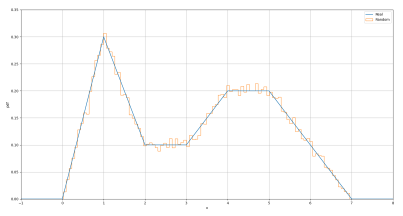
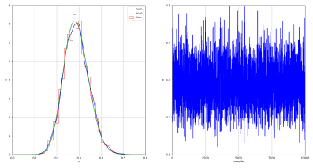
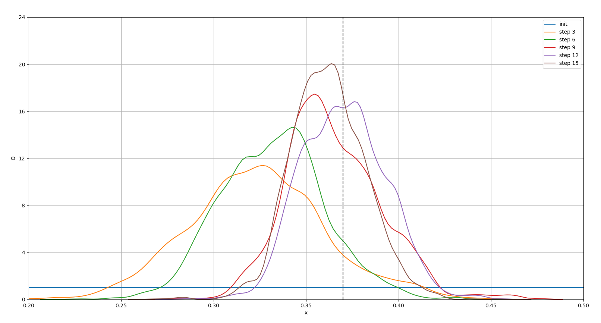

# Multi-Parameter Bayesian Inference Using Markov Chain Monte Carlo (MCMC) Sampling and the Metropolis-Hastings Algorithm

## Features

- Code has been written and tested in Python 3.8.5.

- Likelihood (pdf) can be defined as an arbitrary function with any number of independent parameters.

- Prior functions are defined using a list of list, and can be any pdf from function "prior_dist" in file "Metropolis.py" (other priors can be easily added).

- Jumps in the Metropolis-Hastings algorithm are proposed using a normal   distribution of the parameters.

- Function *random_number* in file *Metropolis.py* can be used to generate random numbers from any arbitrary pdf.

- Results can be verified using the *pymc3* library.

- Usage: *python test.py example*.

## Main Parameters

`example` Name of the example to run.

`likelihood` Name of the likelihood function.

`par` Array with the parameters of the likelihood function.

`n_data` Number of data to be sampled from the likelihood function.

`data` Array with the data sampled from the likelihood function.

`a0`, `b0` Support interval for the likelihood function.

`priors` List with the priors. Each prior is assigned to one of the likelihood parameter following the same order as in `par`.

`samples` Number of jumps to perform in the Metropolis-Hastings algorithm.

`par_init` Initial value for the parameters in the Metropolis-Hastings  algorithm.

`width_prop` Standard deviation of the normal distribution used to search the neighboroud of a parameter. A good value should give about 50% of accepted jumps.

`i0` Index specifying the burn-in/warm-up amount.

`posterior` Array containing the jumps (accepted or rejected) of all parameters.

`jumps` Number of jumps actually accepted.

## Examples

There are four examples: **Random**, **Coin**, **Normal**, and **Coin_upd** (see *test.py* for the specific parameters and full results). A brief description and the resulting plots are shown below.

**Random:**

Generation of random numbers from a generic pdf.

**Coin:**

One parameter (theta), Bernoulli distribution as likelihood, beta distribution as prior, admit an analytical solution.

**Normal:**

Two parameters (mean and standard deviation), normal distribution as likelihood, normal distribution as prior for the mean, gamma distribution as prior for the standard deviation, solution also checked with `pymc3`.

**Coin_upd:**

One parameter (theta), Bernoulli distribution as likelihood, uniform distribution as initial prior, previous posterior as successive prior.

## References

- Wikipedia, "[Metropolis-Hastings Algorithm](https://en.wikipedia.org/wiki/Metropolis-Hastings_algorithm)".

- Wikipedia, "[Markov Chain Monte Carlo](https://en.wikipedia.org/wiki/Markov_chain_Monte_Carlo)".

- "[Bayesian Statistics](https://en.wikipedia.org/wiki/Bayesian_statistics)", Chapter 2 in "[Advanced Algorithmic Trading](https://www.quantstart.com/advanced-algorithmic-trading-ebook/)", by M. Halls-Moore.

- Probabilistic programming in Python using [pymc3](https://docs.pymc.io/).
