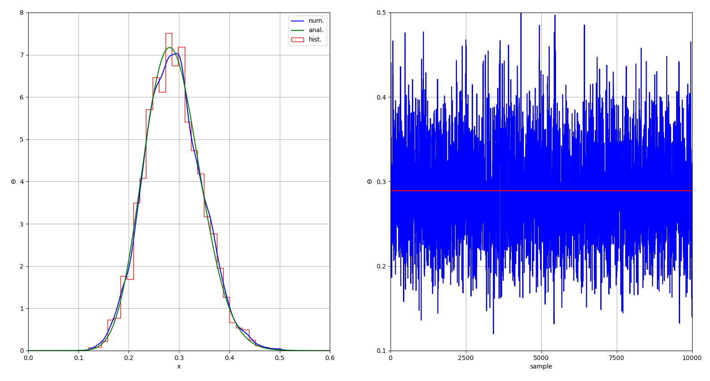
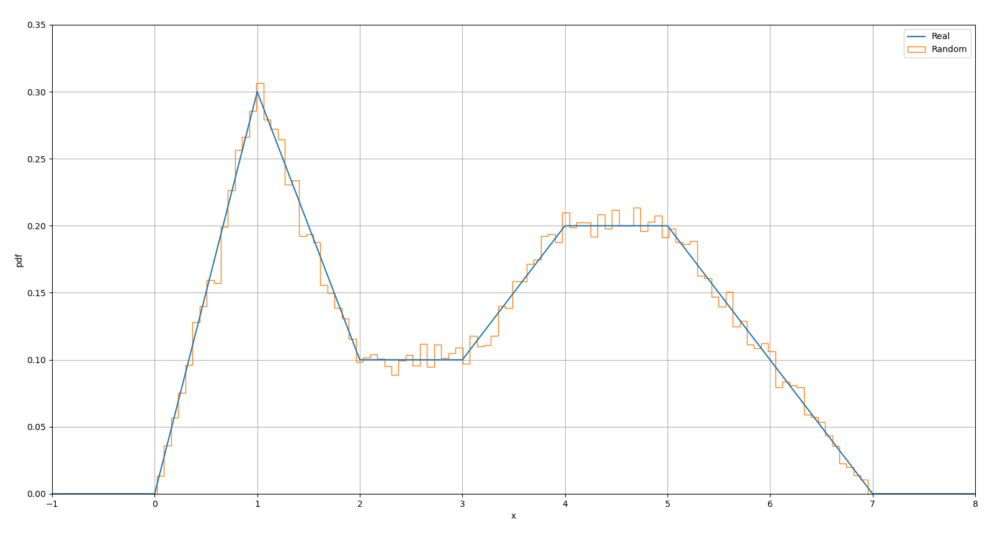

# Multi-Parameter Bayesian Inference Using Markov Chain Monte Carlo (MCMC) Sampling and the Metropolis-Hastings Algorithm

## Features

- Code has been written and tested in Python 3.8.5.

- Likelihood (pdf) can be defined as an arbitrary function with any number of independent parameters.

- Prior functions are defined using a list of list, and can be any pdf from function *prior_dist* in file *Metropolis.py* (other priors can be easily added).

- Jumps in the Metropolis-Hastings algorithm are proposed using a normal   distribution of the parameters.

- Function *random_number* in file *Metropolis.py* can be used to generate random numbers from any arbitrary pdf.

- Results can be verified using the *pymc3* library.

- Usage: *python test.py example*.

## Main Parameters

`example` Name of the example to run.

`likelihood` Name of the likelihood function.

`par` Array with the parameters of the likelihood function.

`n_data` Number of data to be sampled from the likelihood function.

`data` Array with the data sampled from the likelihood function.

`a0`, `b0` Support interval for the likelihood function.

`priors` List with the priors. Each prior is assigned to one of the likelihood parameter following the same order as in `par`.

`samples` Number of jumps to perform in the Metropolis-Hastings algorithm.

`par_init` Initial value for the parameters in the Metropolis-Hastings  algorithm.

`width_prop` Standard deviation of the normal distribution used to search the neighboroud of a parameter. A good value should give about 50% of accepted jumps.

`i0` Index specifying the burn-in/warm-up amount.

`posterior` Array containing the jumps (accepted or rejected) of all parameters.

`jumps` Number of jumps actually accepted.

## Examples

There are four examples: **Coin**, **Normal**, **Coin_upd**, and **Random**, (see *test.py* for the specific parameters and results). A brief description and the resulting plots are shown below.

**Coin:**

One parameter (theta), Bernoulli distribution as likelihood, beta distribution as prior, admit an analytical solution.

```python
# Numerical results:
# - accepted jumps = 52.9%
# - <theta> mean and std = 0.289, 0.057

# Analytical results:
# - <theta> mean and std (anal.) = 0.288, 0.055
```



**Normal:**

Two parameters (mean and standard deviation), normal distribution as likelihood, normal distribution as prior for the mean, gamma distribution as prior for the standard deviation, solution checked with `pymc3`.

```python
# Numerical results:
# - accepted jumps = 52.8%
# - <mu> mean and std = -1.182, 0.230
# - <sigma> mean and std = 0.968, 0.198

# Numerical (pymc3) results:
# - start point =  {'mu': array(2.0), 'sigma': array(5.0)}
# - <mu> mean and std = -1.188, 0.224
# - <sigma> mean and std = 0.972, 0.202
```


**Coin_upd:**

One parameter (theta), Bernoulli distribution as likelihood, uniform distribution as initial prior, previous posterior as successive prior. This example is the same as **Coin** but the resulting posterior is used as prior for the next update. The mean of the posterior should tend to the probability that head comes up, i.e. `0.37`, while its standard deviation should become smaller and smaller.

```python
# Numerical results (after 15 steps):
# - head freq. = 36.4%
# - accepted jumps = 24.0%
# - <theta> mean and std = 0.362, 0.020
```


**Random:**

A generic pdf (a piece-wise function in the example) is correctly approximated using 50000 randomly generated numbers.

```python
# Piece-wise function:
#
# pdf =  0.0                        in [-inf, 0]
# pdf =  0.3 * x                    in (0, 1]
# pdf = -0.2 * x + 0.5              in (1, 2]
# pdf =  0.1                        in (2, 3]
# pdf =  0.1 * x - 0.2              in (3, 4]
# pdf =  0.2                        in (4, 5]
# pdf = -0.1 * x + 0.7              in (5, 7]
# pdf =  0.0                        in (7, +inf]
#
# The integral in [-inf, +inf] is 1.
```




## References

- Wikipedia, "[Metropolis-Hastings Algorithm](https://en.wikipedia.org/wiki/Metropolis-Hastings_algorithm)".

- Wikipedia, "[Markov Chain Monte Carlo](https://en.wikipedia.org/wiki/Markov_chain_Monte_Carlo)".

- "[Bayesian Statistics](https://en.wikipedia.org/wiki/Bayesian_statistics)", Chapter 2 in "[Advanced Algorithmic Trading](https://www.quantstart.com/advanced-algorithmic-trading-ebook/)", by M. Halls-Moore.

- Probabilistic programming in Python using [pymc3](https://docs.pymc.io/).
